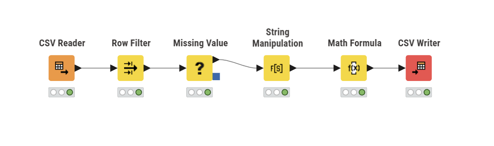
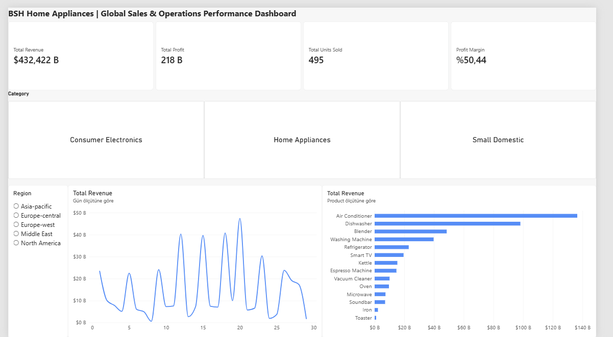

# Global Sales & Operations Automation Pipeline

An enterprise-grade, end-to-end data engineering and business intelligence solution designed to streamline sales performance tracking, clean raw transaction streams, and provide actionable executive insights for global manufacturing operations.

---

## Architecture Overview

| Stage | Technology | Key Operations |
| :--- | :--- | :--- |
| **1. Data Ingestion** | CSV / File Stream | Multi-region transactional raw sales data |
| **2. ETL Pipeline** | KNIME Analytics Platform | Row filtering, null imputation, string manipulation, margin calculation |
| **3. Staging & Export** | Clean CSV Data Mart | Standardized data output ready for analysis |
| **4. Storage & Modeling** | SQL / Star Schema DWH | Dimension and Fact modeling for scalable analytical workloads |
| **5. Business Intelligence** | Microsoft Power BI | Interactive DAX measures, KPI tracking, and regional breakdown |

---

## Key Project Modules

### 1. Automated ETL Pipeline (KNIME Analytics Platform)
* **Ingestion:** Reads transactional multi-region sales datasets with inconsistent formats.
* **Data Quality Checks:** Eliminates invalid transactions (e.g., negative/zero quantities) via `Row Filter`.
* **Missing Value Imputation:** Standardizes null discount structures using `Missing Value`.
* **String Normalization:** Capitalizes and standardizes disparate regional identifiers via `String Manipulation`.
* **Feature Engineering:** Calculates granular margin percentages per line item via `Math Formula` before staging data for visualization.



---

### 2. Business Intelligence & Executive Dashboard (Power BI)
* **High-Level KPIs:** Dynamically tracks Total Revenue, Total Profit, Units Sold, and Profit Margin.
* **Interactive Slicers:** Tile/Button and vertical list slicers for real-time category and regional drilling.
* **Trend & Product Breakdown:** Time-series analysis highlighting revenue trajectories and product profitability rankings.



#### Core DAX Measures
```dax
Total Revenue = SUM(clean_bsh_sales_data[Revenue])

Total Profit = SUM(clean_bsh_sales_data[Profit])

Profit Margin % = DIVIDE([Total Profit], [Total Revenue], 0)

Total Units Sold = SUM(clean_bsh_sales_data[Quantity])
3. Data Warehouse Design (Star Schema DDL)
Modeled for enterprise analytical workloads (PostgreSQL / AWS Redshift compatible):

Fact Table: Fact_Sales

Dimension Tables: Dim_Date, Dim_Product, Dim_Region

```sql
-- Category Performance KPI Query
SELECT 
    p.Category,
    SUM(f.Revenue) AS TotalRevenue,
    SUM(f.Profit) AS TotalProfit,
    ROUND((SUM(f.Profit) / NULLIF(SUM(f.Revenue), 0)) * 100, 2) AS ProfitMarginPct
FROM Fact_Sales f
JOIN Dim_Product p ON f.ProductID = p.ProductID
GROUP BY p.Category
ORDER BY TotalRevenue DESC;
```

---

## Repository Structure

```text
├── data/
│   ├── raw_bsh_appliance_sales.csv
│   └── clean_bsh_sales_data.csv
├── workflows/
│   └── bsh_sales_etl.knwf
├── dashboards/
│   └── bsh_sales_dashboard.pbix
├── sql/
│   └── dwh_schema_and_queries.sql
├── docs/
│   ├── knime_workflow.png
│   └── powerbi_dashboard.png
└── README.md
```

---

## Tech Stack & Skills

* **ETL & Data Prep:** KNIME Analytics Platform
* **Analytics & Visualization:** Microsoft Power BI, DAX
* **Data Modeling & Storage:** SQL, Star Schema, Relational Data Warehousing
* **Process Automation:** Data Pipeline Orchestration & Cleansing
